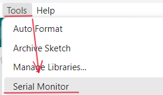
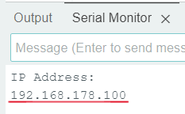
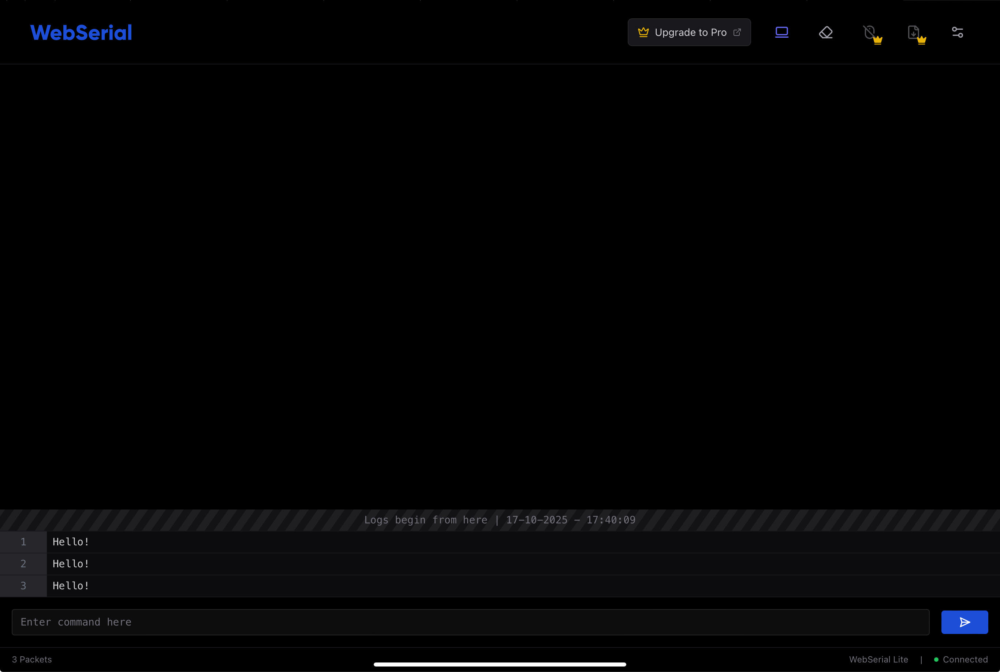
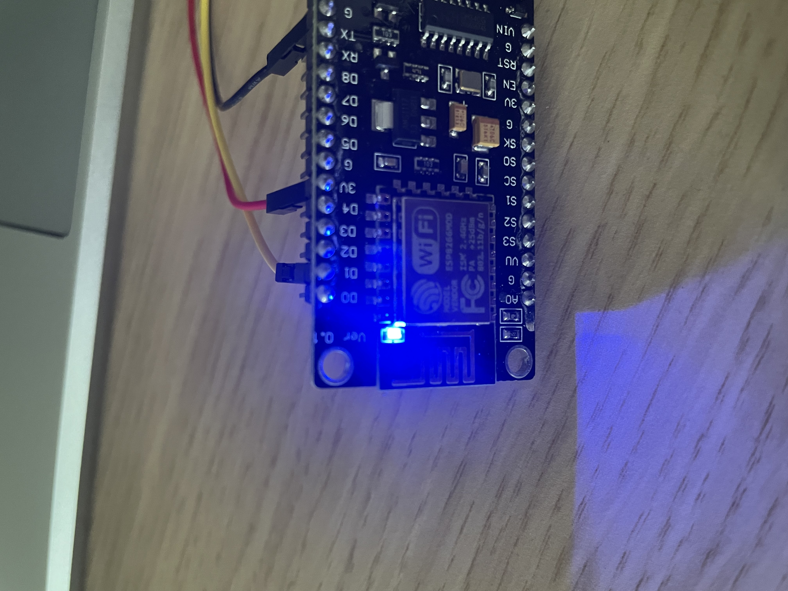
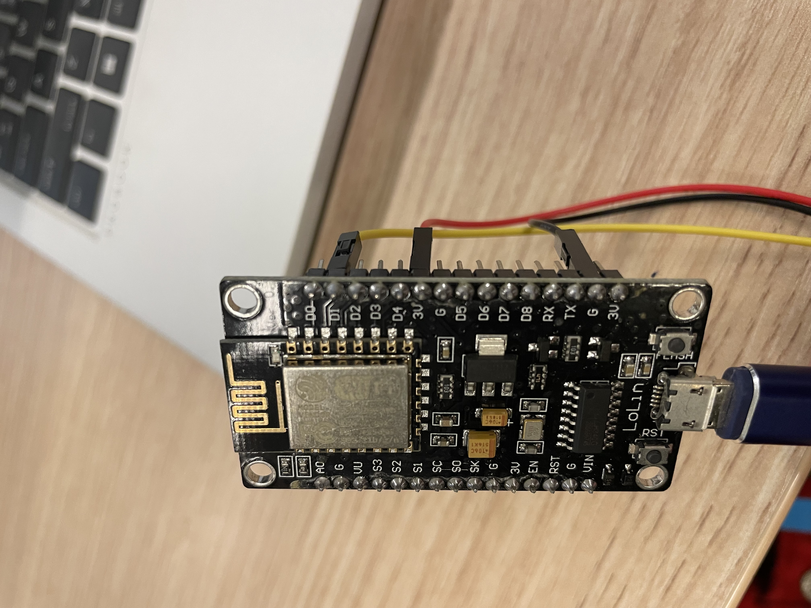
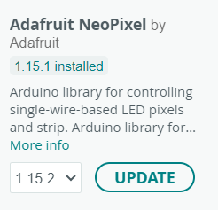
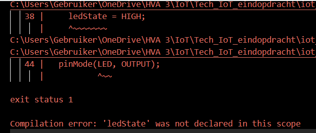

# TubHub IoT finale assignment
This manual is made for my final IoT assignment. I have created an IoT bathtub, named TubHub, that can be remotely controlled through an app. In this manual I'm going to replicate the idea of receiving feedback when the bathtub is full or empty. I can't exactly replicate the idea, so we will use our imagination. To be more specific, I'm going to realise the idea that when the sensors in the tub notice that the bathtub is full, the built-in LED light from the bathtub turns on. In this manual that will translate to: when I send the right command in the web serial, the LED light strip will turn on. 

I will be doing this by using a NodeMCU ESP8266, and I will control the board with a web-based remote serial monitor. This manual will be a step-by-step guide on how you can achieve this. I will discuss any potential errors you might come across along the way and how you can solve these.

## Requirements
For this project you will need a couple of different materials to complete it. We assume you already have these materials.

### ⚙️ Hardware
- NodeMCU ESP8266
- LED light strip

### 🖥️ Software
- [Arduino IDE](https://www.arduino.cc/en/software/) 
- WebSerial

### 📚 Libraries
- WebSerial Library
- ESP8266WiFi Library 
- [ESPAsyncWebServer Library](https://1drv.ms/u/c/c0de0082aef6008a/EYO-SYy1RUZNjCymwH-ZoZEBdtaQtk2wVZRzvVDxAqIJQg?e=F83b8c)
- [ESPAsyncTCP Library](https://1drv.ms/u/c/c0de0082aef6008a/ESKH9enLEhZHkhM7dW_0W_EBv2FRMVZE0S9X_uM3iA8uCw?e=K7beFB)
- Adafruit NeoPixel Library

## Step 1: Setting up Arduino
Before you are going to write our code, you have to get Arduino ready. This means making sure that the right board and port are selected. If this is not the case and you continue, your code will not work.

> ⚠️ Make sure you have your NodeMCU ESP8266 plugged into your laptop before doing this!

Start by opening Arduino IDE. To select the correct board, go to Tools (in the top left corner) > Board > esp8266 > NodeMCU 1.0 (ESP-12E Module).


To select the correct port, go to Tools again > Port > and then choose a COM port; in this case it will be port COM5. 


You have now set up the basics of Arduino!

## Step 2: Installing the libraries
For this project you will need a couple of different libraries to make it work, three to be exact.

First you will install the WebSerial.h library. On the left side of your window in Arduino you will see this icon. Click on it to go to Manage Libraries.

 

If you cannot find this icon, you can also go to Sketch > Include Library > Manage Libraries... .


When you have done this, the Library Manager will pop up on the left side of your Arduino window.

Search for *webserial*, choose the library by Ayush Sharma, it will be the top result. 


Second, you will have to install the ESPAsyncWebServer and the AsyncTCP. Installing these will go a little bit differently, because you can't look these up in the Library Manager. So you will have to download the library files. Click the links down here to get the zip files:

- [ESPAsyncWebServer](https://1drv.ms/u/c/c0de0082aef6008a/EYO-SYy1RUZNjCymwH-ZoZEBdtaQtk2wVZRzvVDxAqIJQg?e=F83b8c)
- [ESPAsyncTCP](https://1drv.ms/u/c/c0de0082aef6008a/ESKH9enLEhZHkhM7dW_0W_EBv2FRMVZE0S9X_uM3iA8uCw?e=K7beFB)

Go to Sketch > Include Library > Add .ZIP Library, it will be right below Manage Libraries... .

Now you might have seen that in the Requirements list there is a fourth library. Fortunately you don't have to install this one for it is already included in your Arduino IDE. 

### Step 2.1: Including the libraries
You have now installed all the necessary libraries, but you're not done yet. The libraries still need to be included, if you don't do this, then they will not work.

To do this, again go to Sketch > Include Library > and then choose the correct libraries. For some you might have to scroll all the way down.

Remember you want to include these libraries:
- ESP8266WIFI
- ESP Async WebServer
- ESP AsyncTCP
- WebSerial

Or you can simply copy this code:
```cpp
#include <Arduino.h>
#include <ESP8266WiFi.h>
#include <ESPAsyncTCP.h>
#include <ESPAsyncWebServer.h>
#include <WebSerial.h>
```
This code needs to be at the top and above everything else.

## Step 3: The code
To check if the code works when you have uploaded it, it is slightly different compared to what it will be. For now we don't include the LED light strip yet, instead we will check if it works by using the web-based remote serial monitor to turn the LED light that is built into your NodeMCU ESP8266 on and off.

Copy this code and paste it below the code for the libraries:
```cpp
#define LED 2

AsyncWebServer server(80);

const char* ssid = "REPLACE_WITH_YOUR_SSID";          // Your WiFi SSID
const char* password = "REPLACE_WITH_YOUR_PASSWORD";  // Your WiFi Password

void recvMsg(uint8_t *data, size_t len){
  WebSerial.println("Received Data...");
  String d = "";
  for(int i=0; i < len; i++){
    d += char(data[i]);
  }
  WebSerial.println(d);
  if (d == "ON"){
    digitalWrite(LED, LOW);
  }
  if (d=="OFF"){
    digitalWrite(LED, HIGH);
  }
}

void setup() {
  Serial.begin(115200);
  pinMode(LED, OUTPUT);
  digitalWrite(LED, HIGH);
  WiFi.mode(WIFI_STA);
  WiFi.begin(ssid, password);
  if (WiFi.waitForConnectResult() != WL_CONNECTED) {
    Serial.printf("WiFi Failed!\n");
    return;
  }
  Serial.println("IP Address: ");
  Serial.println(WiFi.localIP());
  // WebSerial is accessible at "<IP Address>/webserial" in browser
  WebSerial.begin(&server);
  WebSerial.msgCallback(recvMsg);
  server.begin();
}

void loop() {
  WebSerial.println("Hello!");
  delay(2000);
}
```

Before you upload the code, you will have to change this piece of code:
```cpp
const char* ssid = "REPLACE_WITH_YOUR_SSID";          // Your WiFi SSID
const char* password = "REPLACE_WITH_YOUR_PASSWORD";  // Your WiFi Password
```
> Your `SSID` is the name of your WiFi.

When you have done this, you can upload your code. You do this by pressing this icon in the top left corner of your Arduino window.


> ⚠️ ERROR MESSAGE: When uploading the code, I got the error message **Compilation error: 'class WebSerialClass' has no member named 'msgCallback'**. This error message refers to this line of code: `WebSerial.mgsCallback(recvMsg);`, in the function `void setup()`. 
>
>  
> 
> To be more specific, `mgsCallback` isn't used anymore. So the code given in the guide I use for this project is most likely old and thus uses an older version of the WebSerial library that is included, whereas I use the newest version.
> My code is trying to call on the funtion/variable `msgCallback` on the object `WebSerial, but since the guide I used uses on older version of the library this does not work according to the source I used to solve this poblem. 
> The reason `msgCallback()` does not work anymore is because in the newer version of the WebSerial library it doesn't exist anymore. This is also why the error message says **'class WebSerialClass'has no memeber named 'msgCallback'**.
> The correct function is now called `onMessage()`. So I changed the line of code from `WebSerial.mgsCallback(recvMsg)` to:
> ```cpp
> Webserial.onMessage(recvMsg) 
> ```
> The rest of the code in `void setup()` can stay the same as it was.
> When I uploaded the code again after I made the aforementioned change it worked.

### Step 4: Getting the IP Address
To find the web-based serial monitor, you need an IP address. You can find this by opening the serial monitor in Arduino IDE; you do this by going to Tools > Serial monitor. The serial monitor will then open up below.



By uploading the code again, the serial monitor will give you the IP address.

> ⚠️ Make sure that before you upload your code, you have the baud rate set to 115200. 
>
> 
>
> You can change this on the right side of the serial monitor.



### Step 5: Opening the web-based serial monitor
You have now prepared everything you need to open the web-based serial monitor. You can do this on your laptop, but also on a different device. I will be doing this on my iPad. 

> For this you can use any browser, just make sure that it is running on the same network that you added in your code.

Copy the IP address from your serial monitor and paste it in the search bar followed by `/webserial`. 


When you have pressed enter, this will appear in your browser:



As you can see, the serial monitor will repeatedly say _'Hello!'_. This happens because of this piece of code and tells us that it works.

```cpp
void loop() {
  WebSerial.println("Hello!");
  delay(2000);
}
``` 
You can now also test if you can turn the built in LED light on by typing in the command `ON` at the bottom of your screen.


> ⚠️ Make sure that you give the commands in capital letters, like in is written in the code, because if you don't do this it will not work. 

The serial monitor will give the messages `Received Data...` and `ON`, and after that the built-in LED light will turn on. 



You have now successfully made the code work and can turn the LED light on and off remotely through a web-based remote serial monitor!

## Step 6: Setting up the LED light strip
Now that you have made the code work, you're going to tweak it a little bit to make it more aligned with my IoT product (which has been discussed in the introduction). 

The major change is that you will adjust the code so that the LED light strip will turn on when given the right command, instead of the built-in LED light on the NodeMCU ESP8266. The other change will be much simpler; you will change the commands you need to give to make the use of it more realistic in the context of my IoT product. 

When setting up the LED light strip, you need to connect the LED light strip to your NodeMCU ESP8266; it is important that you connect the wires correctly. Your LED light strip has three different coloured wires that you need to connect to the correct pin on your NodeMCU ESP8266. The yellow wire needs to be connected to the D1 pin, the red one to the 3V pin and the black one to the G pin. 

> ⚠️ When doing this it is saver if you unplug your NodeMCU ESP8266 first, and plug it into your laptop again when you are done!



## Step 7: Installing & Including the NeoPixel Library
When working with an LED light strip in Arduino IDE, you need to use the Adafruit NeoPixel Library to make it work. To install the library, go to the Library Manager and look up Adafruit NeoPixel. It will be the first result you get that you need to install.



Then go to Sketch > Include Lirbary > and then select Adafruit NeoPixel. Click on the library, and the correct code will be added on top of the list of libraries you have already included.

If this does not happen, then you can also copy and paste the code below. Make sure you paste it with the other libraries.
```cpp
#include <Adafruit_NeoPixel.h>
```

## Step 8: Changing the code 
To make the LED light strip work, you need to replace the code that makes the built-in LED light work with code for the LED light strip.

First you are going to replace this line of code:
```cpp
#define LED 2
```

In its place you will paste this code:
```cpp
#define PIN D1
#define NUMPIXELS 12

Adafruit_NeoPixel pixels(NUMPIXELS, PIN, NEO_GRB + NEO_KHZ800);
#define DELAYVAL 500
```
> ⚠️ To make the LED light strip work, you need to replace the code that makes the built-in LED light work with code for the LED light strip.

Now you're going to change the code that makes the built-in LED light turn on and off with the right command. This code can be found in the `void recvMsg()` function. 

First you are going to change the code that turns the LED light on, which now looks like this:
```cpp
if (d == "ON"){
  digitalWrite(LED, LOW);
}
```

In this bit of code you need to replace the line `digitalWrite(LED, LOW);` with this code:
```cpp
pixels.clear(); 
for(int i=0; i<NUMPIXELS; i++) {
  pixels.setPixelColor(i, pixels.Color(0, 150, 0));
  pixels.show();
  delay(DELAYVAL);
  ledState = LOW;
}
```

Second, you are going to change the code that turns the LED light off, which looks like this:
```cpp
if (d=="OFF"){
  digitalWrite(LED, HIGH);
}
```

In this bit of code you need to replace the line `digitalWrite(LED, HIGH);` with this code:
```cpp
pixels.clear(); 
pixels.show(); 
ledState = HIGH;
```

## Step 9: Changing the commands
Now that you have altered the necessary code, you can change the commands. The code for the commands can be found in the same function that you have worked on in the previous step. 

First you are going to change the `ON` command. You are going to change this to `BATH_FULL`. Place this new command in this bit of code:
```cpp
if (d == "ON"){
  pixels.clear(); 
  for(int i=0; i<NUMPIXELS; i++) {
    pixels.setPixelColor(i, pixels.Color(0, 150, 0));
    pixels.show();
    delay(DELAYVAL);
    ledState = LOW;
  }
}
``` 

Now you are going to change the `OFF` command. You are going to change this to `BATH_EMPTY`. Place this new command in this bit of code:
```cpp
if (d=="OFF"){
  pixels.clear(); 
  pixels.show(); 
  ledState = HIGH;
}
```

Now your new code will look like this:
```cpp
#include <Adafruit_NeoPixel.h>
#include <Arduino.h>
#include <ESP8266WiFi.h>
#include <ESPAsyncTCP.h>
#include <ESPAsyncWebServer.h>
#include <WebSerial.h>

#define PIN D1
#define NUMPIXELS 12

Adafruit_NeoPixel pixels(NUMPIXELS, PIN, NEO_GRB + NEO_KHZ800);
#define DELAYVAL 500

AsyncWebServer server(80);

const char* ssid = "Ziggo9328769";          // Your WiFi SSID
const char* password = "bajKbowkm6h9bsUh";  // Your WiFi Password

void recvMsg(uint8_t *data, size_t len){
  WebSerial.println("Received Data...");
  String d = "";
  for(int i=0; i < len; i++){
    d += char(data[i]);
  }
  WebSerial.println(d);
  if (d == "BATH_FULL"){
    pixels.clear(); 
    for(int i=0; i<NUMPIXELS; i++) {
      pixels.setPixelColor(i, pixels.Color(0, 150, 0));
      pixels.show();
      delay(DELAYVAL);
      ledState = LOW;
    }
  }
  if (d=="BATH_EMPTY"){
    pixels.clear(); 
    pixels.show(); 
    ledState = HIGH;
  }
}

void setup() {
  Serial.begin(115200);
  pinMode(LED, OUTPUT);
  digitalWrite(LED, HIGH);
  WiFi.mode(WIFI_STA);
  WiFi.begin(ssid, password);
  if (WiFi.waitForConnectResult() != WL_CONNECTED) {
    Serial.printf("WiFi Failed!\n");
    return;
  }
  Serial.println("IP Address: ");
  Serial.println(WiFi.localIP());
  // WebSerial is accessible at "<IP Address>/webserial" in browser
  WebSerial.begin(&server);
  WebSerial.onMessage(recvMsg);
  server.begin();
}

void loop() {
  WebSerial.println("Hello!");
  delay(2000);
}
```

## Step 10: Uploading the final code
You have completely changed the code to what you need it to be, so it's now time to upload it.

> ⚠️ ERROR MESSAGE: When uploading the code I got the error messages **Compilation error: 'ledState' was not declared in this scope** and **error: 'LED' was not declared in this scope**. The error message refers to these lines of code: `ledState = LOW;`, `ledState = HIGH;` and `pinMode(LED, OUTPUT);`. The first two lines are in the `void recvMsg()` function and the last one is in the `void setup()` function.
>
> 
>
> This error message means that the variable `ledState` is not known and thus cannot be read. This can be caused by a couple of different reasons:
> 1. `ledState` is not declared.
> 2. `ledStat` is declared in a different scope.
> 3. There is a spelling mistake in the `ledState` variable.
> In my case I have not declared `ledState` and `LED`. To make it work the variable needs to be declared, and it isn't right now. 
> After looking through the source I used for the LED light strip code, I found this code:
> ```cpp
> const int ledPin = 2;
> bool ledState = HIGH; 
> ```
> I checked, and this code will declare both `ledPin` (so now my LED has its own pin) and `ledState`. 
> According to the source I used to solve this problem this is not all I need to do to make the code work. The source tells me that I need to make some changes and add some code in the `setup()` and `recvMsg()` functions. 
> In the `setup()` function I need to install the pin. I do this by changing the `pinMode()` and `digitalWrite()` code.
> So change that code to this:
> ```cpp
> pinMode(ledPin, OUTPUT);
> digitalWrite(ledPin, ledState);
> ```
>
> In the `recvMsg()` function I need to add the this line of code:
> ```cpp
> digitalWrite(ledPin, ledState);
> ````
> This code needs to be added to the code that turns the LED light strip on and off. 
> After making these changes I did not get anymore error messages.

The new code after testing:
```cpp
#include <Adafruit_NeoPixel.h>
#include <Arduino.h>
#include <ESP8266WiFi.h>
#include <ESPAsyncTCP.h>
#include <ESPAsyncWebServer.h>
#include <WebSerial.h>

#define PIN D1
#define NUMPIXELS 12

Adafruit_NeoPixel pixels(NUMPIXELS, PIN, NEO_GRB + NEO_KHZ800);
#define DELAYVAL 500

const int ledPin = 2;
bool ledState = HIGH;

AsyncWebServer server(80);

const char* ssid = "Ziggo9328769";          // Your WiFi SSID
const char* password = "bajKbowkm6h9bsUh";  // Your WiFi Password

void recvMsg(uint8_t *data, size_t len){
  WebSerial.println("Received Data...");
  String d = "";
  for(int i=0; i < len; i++){
    d += char(data[i]);
  }
  WebSerial.println(d);
  if (d == "BATH_FULL"){
    pixels.clear(); 
    for(int i=0; i<NUMPIXELS; i++) {
      pixels.setPixelColor(i, pixels.Color(0, 150, 0));
      pixels.show();
      delay(DELAYVAL);
      ledState = LOW;
      digitalWrite(ledPin, ledState);
    }
  }
  if (d=="BATH_EMPTY"){
    pixels.clear(); 
    pixels.show(); 
    ledState = HIGH;
    digitalWrite(ledPin, ledState);
  }
}

void setup() {
  Serial.begin(115200);
  pinMode(ledPin, OUTPUT);
  digitalWrite(ledPin, ledState);
  WiFi.mode(WIFI_STA);
  WiFi.begin(ssid, password);
  if (WiFi.waitForConnectResult() != WL_CONNECTED) {
    Serial.printf("WiFi Failed!\n");
    return;
  }
  Serial.println("IP Address: ");
  Serial.println(WiFi.localIP());
  // WebSerial is accessible at "<IP Address>/webserial" in browser
  WebSerial.begin(&server);
  WebSerial.onMessage(recvMsg);
  server.begin();
}

void loop() {
  WebSerial.println("Hello!");
  delay(2000);
}
```

## Step 11: Testing if you can control the LED strip with the web-based serial monitor
Now that you have completed the code, you can test if you can turn the LED light strip on and off with the web-based serial monitor. 

Go back to the serial monitor in Arduino, copy the IP address and fill this in in the search bar of your browser. Don't forget to add `/webserial` behind it. You will then get the same screen in your browser as in the previous step. 

Fill in the command `BATH_FULL` to turn the LED light strip on. 

> ⚠️ When I entered the command, it did not work. According to a source, my code is correct and compiles fine. However, it does say that the way I'm handling the LED strip in `recvMsg()` is probably the reason why the code is not working the way I expect.
> First it says that `delay()` blocks everything. Second it say that `pixel.show()` in the loop makes it extra slow. Third it says that the `loop()` also causes a delay. Lastly it says I never initalise the LED strip. So I'm going to fix that.
> First the `delay()`. I need to remove the `delay()` in my `void recvMsg()`. By doing this I also need to remove one of the `pixels.show()`. When I make the changes, the code looks like this:
> ```cpp
> if (d== "BATH_FULL"){
>   pixels.clear(); 
>   for(int i=0; i<NUMPIXELS; i++) {
>     pixels.setPixelColor(i, pixels.Color(0, 150, 0));
>     pixels.show();
>     ledState = LOW;
>     digitalWrite(ledPin, ledState);
>   }
> }
> if (d=="BATH_EMPTY"){
>   pixels.clear(); 
>   ledState = HIGH;
>   digitalWrite(ledPin, ledState);
> }
> ```
>
> Second the `pixel.show()`. It asks that I place this outside the loop, so the code changes to this:
> ```cpp
>  if (d== "BATH_FULL"){
>   pixels.clear(); 
>   for(int i=0; i<NUMPIXELS; i++) {
>     pixels.setPixelColor(i, pixels.Color(0, 150, 0));
>     ledState = LOW;
>     digitalWrite(ledPin, ledState);
>   }
>   pixels.show();
> }
> ```
>
> Third the `loop()`. This I didn't change, because I still need it to see if the web-based serial monitor is working.
>
> Lastly intialising the LED light strip. I do this by adding this line of code:
> ```cpp
> pixels.begin();
> ``` 
>
> I uploaded the code again and didn't get anymore error messages.

## Step 12: Final result
After fixing the initial error message, this is now the new working code:
```cpp
#include <Adafruit_NeoPixel.h>
#include <Arduino.h>
#include <ESP8266WiFi.h>
#include <ESPAsyncTCP.h>
#include <ESPAsyncWebServer.h>
#include <WebSerial.h>

#define PIN D1
#define NUMPIXELS 12

Adafruit_NeoPixel pixels(NUMPIXELS, PIN, NEO_GRB + NEO_KHZ800);
#define DELAYVAL 500

const int ledPin = 2;
bool ledState = HIGH;

AsyncWebServer server(80);

const char* ssid = "Ziggo9328769";          // Your WiFi SSID
const char* password = "bajKbowkm6h9bsUh";  // Your WiFi Password

void recvMsg(uint8_t *data, size_t len){
  WebSerial.println("Received Data...");
  String d = "";
  for(int i=0; i < len; i++){
    d += char(data[i]);
  }
  WebSerial.println(d);
  if (d== "BATH_FULL"){
    pixels.clear(); 
    for(int i=0; i<NUMPIXELS; i++) {
      pixels.setPixelColor(i, pixels.Color(0, 150, 0));
      ledState = LOW;
      digitalWrite(ledPin, ledState);
    }
    pixels.show();
  }
  if (d=="BATH_EMPTY"){
    pixels.clear(); 
    pixels.show();
    ledState = HIGH;
    digitalWrite(ledPin, ledState);
  }
}

void setup() {
  Serial.begin(115200);
  pixels.begin();
  pinMode(ledPin, OUTPUT);
  digitalWrite(ledPin, ledState);
  WiFi.mode(WIFI_STA);
  WiFi.begin(ssid, password);
  if (WiFi.waitForConnectResult() != WL_CONNECTED) {
    Serial.printf("WiFi Failed!\n");
    return;
  }
  Serial.println("IP Address: ");
  Serial.println(WiFi.localIP());
  // WebSerial is accessible at "<IP Address>/webserial" in browser
  WebSerial.begin(&server);
  WebSerial.onMessage(recvMsg);
  server.begin();
}

 void loop() {
  WebSerial.println("Hello!");
  delay(2000);
}
```
The video with the final result can be found [here](https://youtube.com/shorts/rqGYmrKH1o4).

## Source references
- [The guide I followed to do this project](https://randomnerdtutorials.com/esp8266-nodemcu-webserial-library/) 
- [The source I used to solve the first error message](https://chatgpt.com/share/68f25c9c-b5d0-8000-8d2c-f9b5d61ef164)
- [The code in needed for the LED light strip I got from another manual that I wrote](https://github.com/Ivy-Schuurman/Telegram_NodeMCU_manual)
- [The source I used to solve the second error message](https://chatgpt.com/share/68f296b6-24e8-8000-ad1d-a98495773061)
- [The source I used to solve the third error message](https://chatgpt.com/share/68f2abc6-ad5c-8000-9fc9-2d6a46a18448)