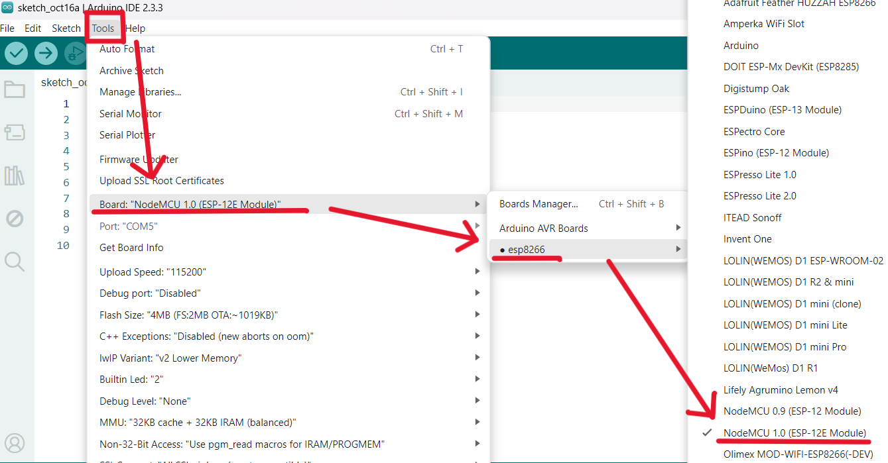
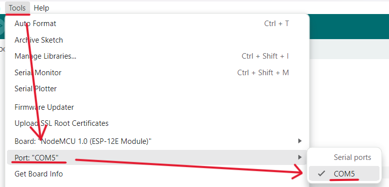
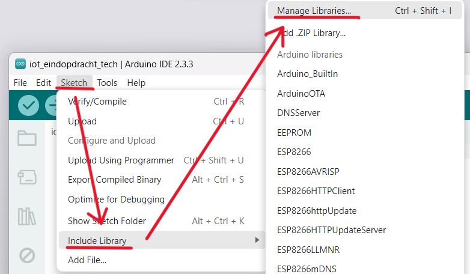
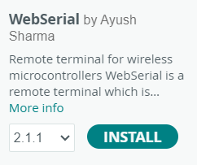
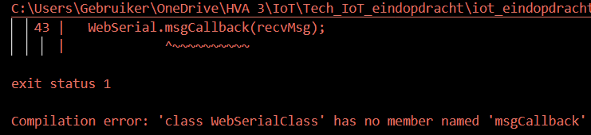

# TubHub IoT finale assignment
This manual is made for my final IoT assignment. I have created an IoT bathtub, named TubHub, that can be remotely controlled throught an app. In this manual I'm going to replicate the idea of controlling the bathtub with the app and receiving feedback. I can't exactly replicate the idea, so we will use our imagination. To be more specific I'm going to realize the idea that when the user receives the message that the bathtub is full, the build in LED light from the bathtub also turns on. In this manual that will translate to that when I send a message in the webserial, the LED light strip will turn on. 

I will be doing this by using a NodeMCU ESP8266, and I will controle the board with a web-based remote serial monitor. This manual will be a step by step guide on how you can achieve this. I will discus any potential errors you might come across along the way and how you can solve these.

## Requirements
For this project you will need a couple of different materials to complete it. We asume you already have these materials.

### ⚙️ Hardware
- NodeMCU ESP8266
- LED light strip

### 🖥️ Software
- [Arduino IDE](https://www.arduino.cc/en/software/) 
- 

### 📚 Libraries
- WebSerial.h 
- ESP8266WiFi.h
- [ESPAsyncWebServer](https://1drv.ms/u/c/c0de0082aef6008a/EYO-SYy1RUZNjCymwH-ZoZEBdtaQtk2wVZRzvVDxAqIJQg?e=F83b8c)
- [ESPAsyncTCP](https://1drv.ms/u/c/c0de0082aef6008a/ESKH9enLEhZHkhM7dW_0W_EBv2FRMVZE0S9X_uM3iA8uCw?e=K7beFB)

## Step 1: Setting up Arduino
Before you are going to write our code you have to get Arduino ready. This means making sure that the right board and port is selected. If this is not the case and you continue, your code will not work.

> ⚠️ Make sure you have your NodeMCU ESP8266 plugged into your laptop before doing this!

Start by opening Arduino IDE. To select the correct board go to Tools (in the top left corner) > Board: > esp8266 > NodeMCU 1.0 (ESP-12E Module).



To select the correct port go to Tools again > Port: > and then choose a COM port, in this case it will be port COM5. 



You have now set up the basics of Arduino!

### Step 1.1: Setting up the LED light strip
Your LED light strip has three different coloured wires that you need to connect to the correct pin on your NodeMCU ESP8266. The yellow wire needs to be connected to D1 pin, the red one to 3V pin and black one to the G pin. 


> ⚠️ When doing this it is better if you unplug your NodeMCU ESP8266, and plug it into your laptop again when you are done!

## Step 2: Installing the libraries
For this project you will need a couple of different libraries to make it work, three to be exact.

First you will install the WebSerial.h library. On the left side of your window in Arduino you will see this icon. Click on it to go to Manage Libraries

 

If you cannot find this icon, you can also go to Sketch > Include Library > Manage Libraries... .,



When you have done this, the Library Manager will op on the left side of your Arduino window.

Search for *webserial*, choose the library by Ayush Sharma, it will be the top result. 



Second you will have to install the ESPAsyncWebServer and the AsyncTCP. Installing these will go a little bit differently, because you can't look these up in the Library Manager. So you will have to download the libraries files. Click the links down here to get the zip files:

- [ESPAsyncWebServer](https://1drv.ms/u/c/c0de0082aef6008a/EYO-SYy1RUZNjCymwH-ZoZEBdtaQtk2wVZRzvVDxAqIJQg?e=F83b8c)
- [ESPAsyncTCP](https://1drv.ms/u/c/c0de0082aef6008a/ESKH9enLEhZHkhM7dW_0W_EBv2FRMVZE0S9X_uM3iA8uCw?e=K7beFB)

Go to Sketch > Include Library > Add .ZIP Library, it will be right below Manage Libraries... .

Now you might have seen that in the Requirements list there is a fourth library. Fortunaly you don't have to install this one for it is already included in your Arduino IDE. 

### Step 2.1: Including the libraries
You have now installed all the neccessary libraries, but you're not done yet. The libraries still need to be included, if you don't do this then they will not work.

To do this, again go to Sketch > Include Library > and then choose the correct libraries. For some you might have to scroll all the way down.

Remeber you want to include the:
- ESP8266WIFI
- ESP Async WebServer
- ESP AsyncTCP
- WebSerial

Or you can simply copy this code
```cpp
#include <Arduino.h>
#include <ESP8266WiFi.h>
#include <ESPAsyncTCP.h>
#include <ESPAsyncWebServer.h>
#include <WebSerial.h>
```
This code needs to be at the top and above everything else.

## Step 3: The code
To check if the code works when you have uploaded it, it is slightly different compared to what it will be. For now we don't include the LED light strip yet, instead we will check if it works by using the web-based remote serial monitor to turn the LED light that is build into your NodeMCU ESP8266 on and off.

Copy this code and past it below the code for the libraries
```cpp
#define LED 2

AsyncWebServer server(80);

const char* ssid = "REPLACE_WITH_YOUR_SSID";          // Your WiFi SSID
const char* password = "REPLACE_WITH_YOUR_PASSWORD";  // Your WiFi Password

void recvMsg(uint8_t *data, size_t len){
  WebSerial.println("Received Data...");
  String d = "";
  for(int i=0; i < len; i++){
    d += char(data[i]);
  }
  WebSerial.println(d);
  if (d == "ON"){
    digitalWrite(LED, LOW);
  }
  if (d=="OFF"){
    digitalWrite(LED, HIGH);
  }
}

void setup() {
  Serial.begin(115200);
  pinMode(LED, OUTPUT);
  digitalWrite(LED, HIGH);
  WiFi.mode(WIFI_STA);
  WiFi.begin(ssid, password);
  if (WiFi.waitForConnectResult() != WL_CONNECTED) {
    Serial.printf("WiFi Failed!\n");
    return;
  }
  Serial.println("IP Address: ");
  Serial.println(WiFi.localIP());
  // WebSerial is accessible at "<IP Address>/webserial" in browser
  WebSerial.begin(&server);
  WebSerial.msgCallback(recvMsg);
  server.begin();
}

void loop() {
  WebSerial.println("Hello!");
  delay(2000);
}
```

Before you upload the code, you will have to change this piece of code
```cpp
const char* ssid = "REPLACE_WITH_YOUR_SSID";          // Your WiFi SSID
const char* password = "REPLACE_WITH_YOUR_PASSWORD";  // Your WiFi Password
```
> Your SSID is the name of your wifi.

When you have done this you can upload your code. You do this by pressing this icon in the top left corner of your Arduino window.


> ⚠️ ERROR MESSAGE: When uploading the code I got the error message **Compilation error: 'class WebSerialClass' has no member named 'msgCallback'**. This error message talks about this piece of code: `WebSerial.mgsCallback(recvMsg);`.
> 
>  


## Source references
- [The guide I followed to do this project](https://randomnerdtutorials.com/esp8266-nodemcu-webserial-library/) 

